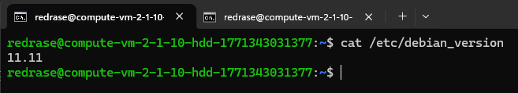
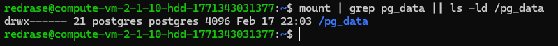
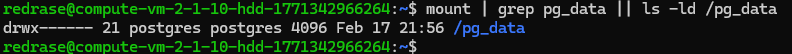

# Условие задачи
- Поднять 2 виртуалки 
- Воткнуть дополнительный диск в вашу виртуалку (но можно просто выделить партицию на текущем диске) в качестве отдельного диска под данные базы

# Выполнение
Были арендованы 2 виртуальные машины на грант от Яндекса (ip изменены, т. к. ВМ уже отключены):
- 84.252.137.133
- 10.129.0.32

Для начала осуществляется обновление ВМ, сверка версий, установка необходимых утилит и т. д:
```bash
sudo apt update
sudo apt install -y gnupg2 curl ca-certificates lsb-release sudo vim
cat /etc/debian_version
```
Версия 1 ВМ:


Версия 2 ВМ:


Далее установка самого postgres. Сначала необходимо добавить оф. ключ:
```bash
curl -fsSL https://www.postgresql.org/media/keys/ACCC4CF8.asc \
  | sudo gpg --dearmor -o /usr/share/keyrings/postgresql.gpg

sudo sh -c 'echo "deb [signed-by=/usr/share/keyrings/postgresql.gpg] http://apt.postgresql.org/pub/repos/apt bullseye-pgdg main" > /etc/apt/sources.list.d/pgdg.list'
```

Учитывая то, что ВМ арендованные, добавить дополнительный диск технически невозможно.

Для начала устанавливаем сервер и клиент postgres:
```bash
sudo apt install -y postgresql-16 postgresql-client-16 postgresql-contrib-16
```

Для postgres нужно место. Создаём директорию pg_data и выдаём необходимые права:
```bash
sudo mkdir -p /pg_data

sudo chown postgres:postgres /pg_data
sudo chmod 700 /pg_data
```

Так же можно дополнительно удалить существующий кластер, который был создан автоматически (для следующего задания):
```bash
sudo systemctl stop postgresql
sudo pg_dropcluster --stop 13 main || true
```

Проверка завершения задачи:
```bash
mount | grep pg_data || ls -ld /pg_data

psql --version
```

1 ВМ:


2 ВМ:
