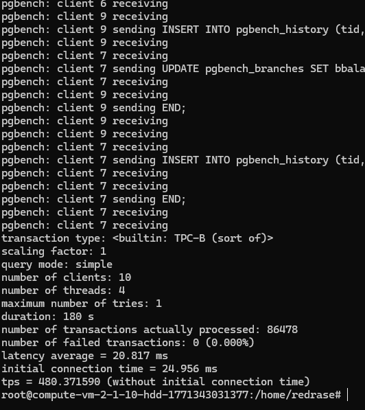
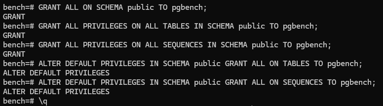
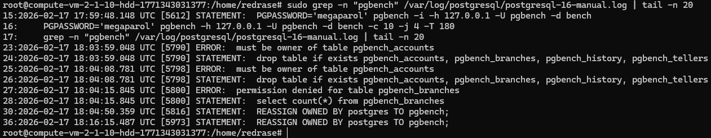
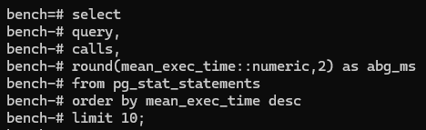
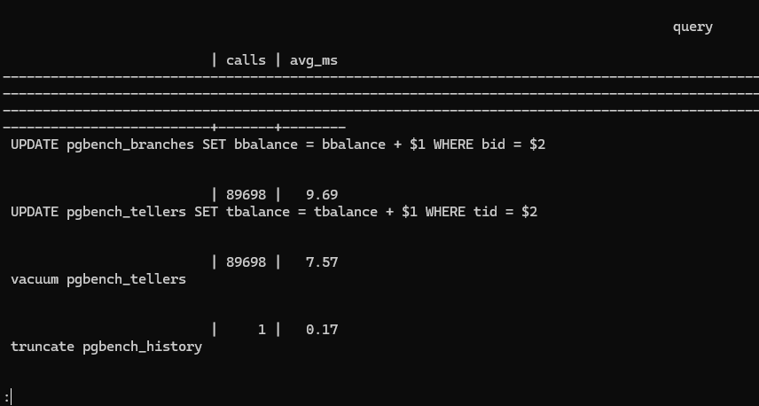
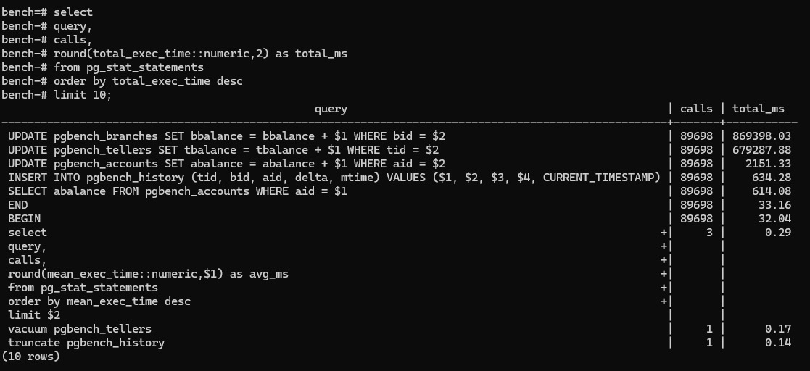

# Условие задачи
- установить postgresql
   Руками проинициализировать инстанс БД с данными в папке /pg_data/16/

- На Первой виртуалке 
  1. Создать отдельного пользователя pgbench с правами на database bench
  2. подключить несколько модулей https://postgrespro.ru/docs/postgrespro/18/installing-additional-modules
  3. настроить логирование всех запросов
  4. c помощью утилиты pgbench проведите нагрузочное тестирование на базку
  5. После завершения нагрузочного тестирования, получите список самых ресурсоемких по IO time write и самых длительных запросов (execution time) из представления pg_stat_statements
  6. логах показать что делал pg_bench
  7. Создать пользователя для репликации
  8. Настроить доступы пользователю чтобы с другой виртуалки можно было подключиться

# Выполнение
Сначала настраиваются IP в inventory:
```bash
ansible-playbook -i inventory.ini main.yaml \
  --user debian \
  --private-key ~/.ssh/id_ed25519
```

ssh_key можно легко сгенерировать, а находится он в .ssh:


После конфигурации playbook начинается работа с postgres.

Для начала создается база данных и пользователь, так же добавляются расширения:
```bash
CREATE DATABASE bench;
CREATE ROLE pgbench LOGIN PASSWORD 'megaparol';
GRANT ALL PRIVILEGES ON DATABASE bench TO pgbench;

\c bench

CREATE EXTENSION IF NOT EXISTS pg_stat_statements;
CREATE EXTENSION IF NOT EXISTS pgrowlocks;
```

После этого можно настроить /etc/postgresql/16/main/postgresql.conf:
```
shared_preload_libraries = 'pg_stat_statements'
wal_level = logical
max_wal_senders = 10 
max_replication_slots = 10
listen_addresses = '*'
log_statement = 'all'
log_line_prefix = '%m [%p] %u@%d %r '
```

В файле /etc/postgresql/16/main/pg_hba.conf для следующего задания разрешаем репликацию:
```
host replication repl_user 0.0.0.0/0          scram-sha-256
```

Теперь можно приступить к тестированию. Инициализируем и запускаем нагрузку в 3 минуты:
```bash
PGPASSWORD='megaparol' pgbench -i -h 127.0.0.1 -d bench -U pgbench 

PGPASSWORD='megaparol' pgbench -h 127.0.0.1 -d bench -U pgbench -T 180 -c 10 -j 4
```

В конце получаем следующую картину:


У пользователя недостаточно прав, поэтому подключаемся к БД и добавляем их ему:


Повторяем нагрузку, и смотрим логи в /var/log/postgresql/postgresql-16-manual.log:


Подробности можно получить через SQL-запросы. Среднее время запроса:




Время всех запросов:


Для следующего задания создаем нового пользователя:
```sql
CREATE ROLE repl_user WITH REPLICATION LOGIN PASSWORD 'megaparol';
```