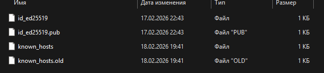

# Условие задачи
- установить postgresql
   Руками проинициализировать инстанс БД с данными в папке /pg_data/16/

- На Первой виртуалке 
  1. Создать отдельного пользователя pgbench с правами на database bench
  2. подключить несколько модулей https://postgrespro.ru/docs/postgrespro/18/installing-additional-modules
  3. настроить логирование всех запросов
  4. c помощью утилиты pgbench проведите нагрузочное тестирование на базку
  5. После завершения нагрузочного тестирования, получите список самых ресурсоемких по IO time write и самых длительных запросов (execution time) из представления pg_stat_statements
  6. логах показать что делал pg_bench
  7. Создать пользователя для репликации
  8. Настроить доступы пользователю чтобы с другой виртуалки можно было подключиться

# Выполнение
Сначала настраиваются IP в inventory:
```bash
ansible-playbook -i inventory.ini main.yaml \
  --user debian \
  --private-key ~/.ssh/id_ed25519
```

ssh_key можно легко сгенерировать, а находится он в .ssh:
